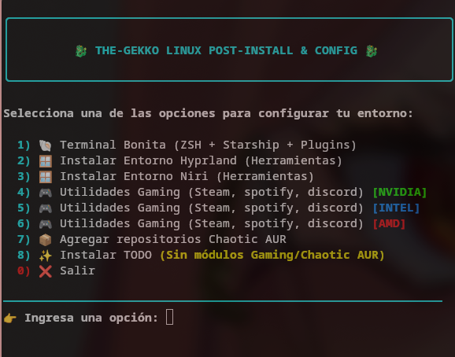

# 🚀 Linux Personalizer & Gaming Setup

Una herramienta integral diseñada para automatizar la configuración de tu entorno Linux, optimizar tu terminal y dejar tu sistema listo para el gaming y la productividad.

## ✨ Características Principales

Este script facilita la transición a un entorno personalizado, encargándose de las tareas tediosas por ti:

### 💻 Terminal & Shell

  * **Kitty Terminal:** Configuración optimizada con soporte para ligaduras y temas.
  * **Zsh + Plugins:** Instalación automática de `zsh` junto con:
      * `zsh-syntax-highlighting` (resaltado de comandos).
      * `zsh-autosuggestions` (sugerencias basadas en historial).
      * Temas populares (Powerlevel10k / Oh My Zsh).

### 🛠️ Ecosistema Wayland (Hyprland & Niri)

  * Instalación de herramientas esenciales para **Hyprland** y **Niri**.
  * Configuración de barras de estado, notificaciones y selectores de aplicaciones.

### 📦 Repositorios & Paquetes

  * **Chaotic-AUR:** Configuración rápida del repositorio para obtener binarios pre-compilados y kernels optimizados sin esperar horas de compilación.

### 🎮 Gaming & Drivers

Optimización completa según tu hardware para que solo tengas que abrir Steam y jugar:

  * **NVIDIA:** Instalación de drivers propietarios y parches de Wayland.
  * **AMD/Intel:** Configuración de Mesa y drivers Vulkan.
  * **Herramientas:** Instalación de Gamemode, Wine-staging, Lutris y dependencias necesarias.

-----

## 🚀 Instalación

Para ejecutar la herramienta, simplemente clona el repositorio y lanza el script principal:

```bash
git clone https://github.com/The-Gekko/GekkoApp.git
cd GekkoApp
chmod +x GekkoApp.sh
./GekkoApp.sh
```

> [\!IMPORTANT]
> Se recomienda ejecutar este script en una instalación limpia o tener un backup de tus archivos de configuración actuales (`.config`).

-----

## 🛠️ Requisitos

  * Una distribución basada en **Arch Linux** (recomendado).
  * Conexión a internet estable.
  * Permisos de sudo.

-----

## 📸 Screenshots



| Terminal (Kitty + Zsh) | Gaming Setup |
| :--- | :--- |
|  |  |

-----

Desarrollado con ❤️ para la comunidad de Linux.

-----

### Algunos consejos extra para tu repo:

  * **Añade un archivo de licencia:** Generalmente la licencia MIT es la más común para estos proyectos.
  * **Usa Emojis:** Ayudan a romper la monotonía del texto y guían la vista.
  * **Badges:** Los escudos al principio (como los de licencia o estrellas) le dan un toque profesional.